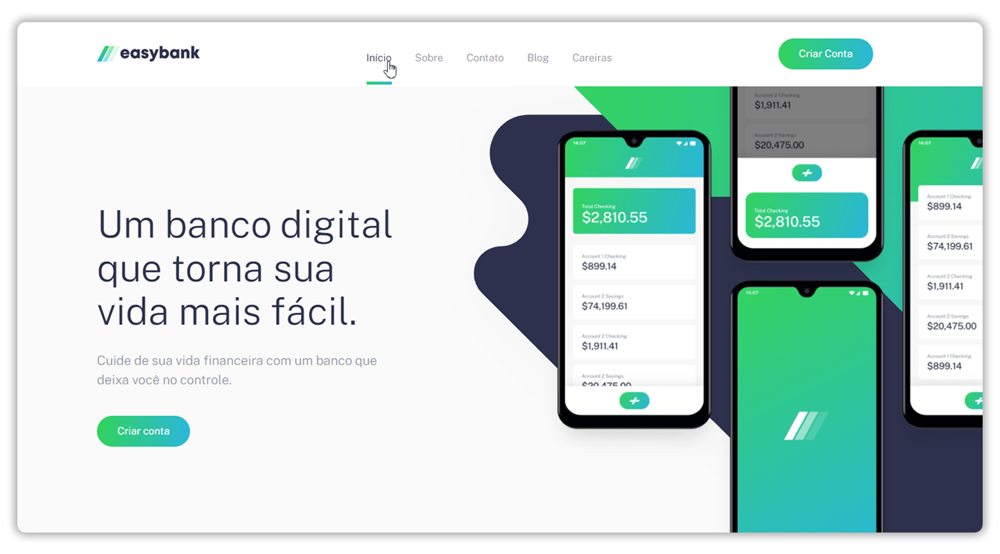
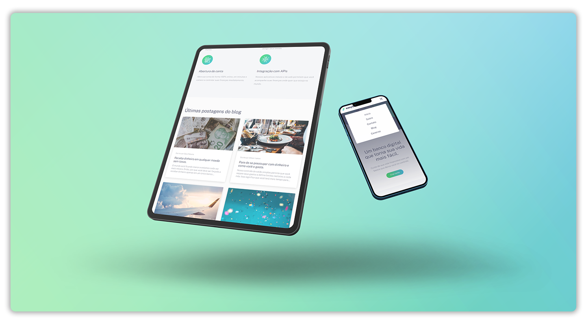
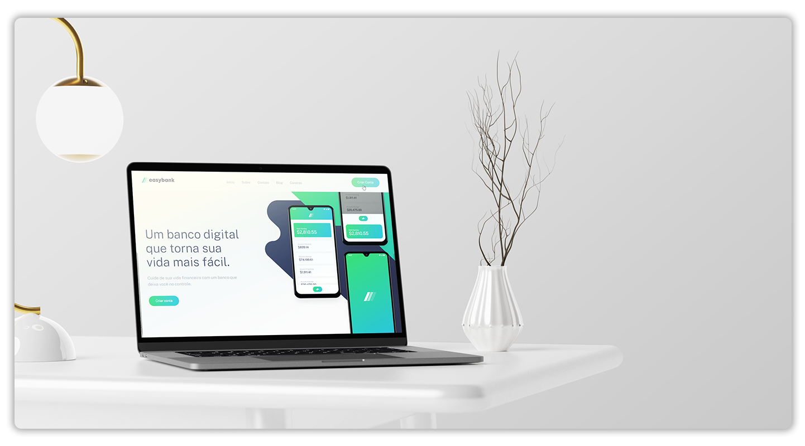

# Primeiro landing page concluído.

Landing page responsiva para meu primeiro repósitório do github, apenas explorando até onde vai o meu conhecimento.

## 🔧 Funções

### Responsivo
- Suporte resposivo para smartphones, tablets

e desktops. 😉

## Feito Com:

## 🤝 Contribuição

Projeto pessoal de portifólio, privado, sorry.

## 🔖 Licensa

### Contato

Copyright © 2021 Igor Dequi Liotto

